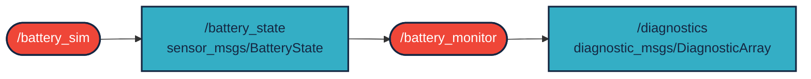
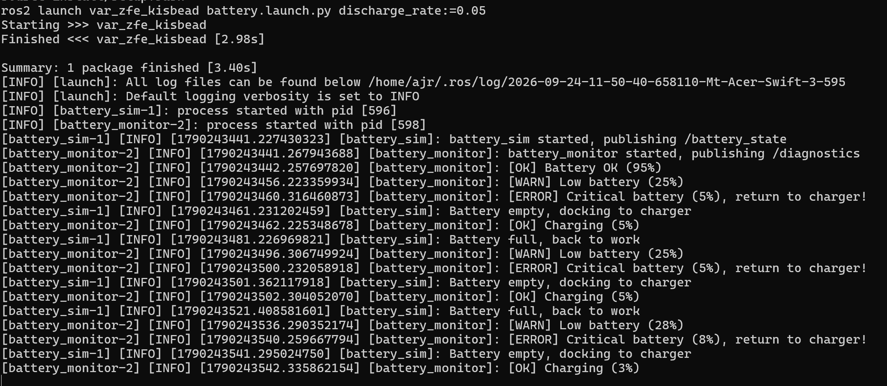
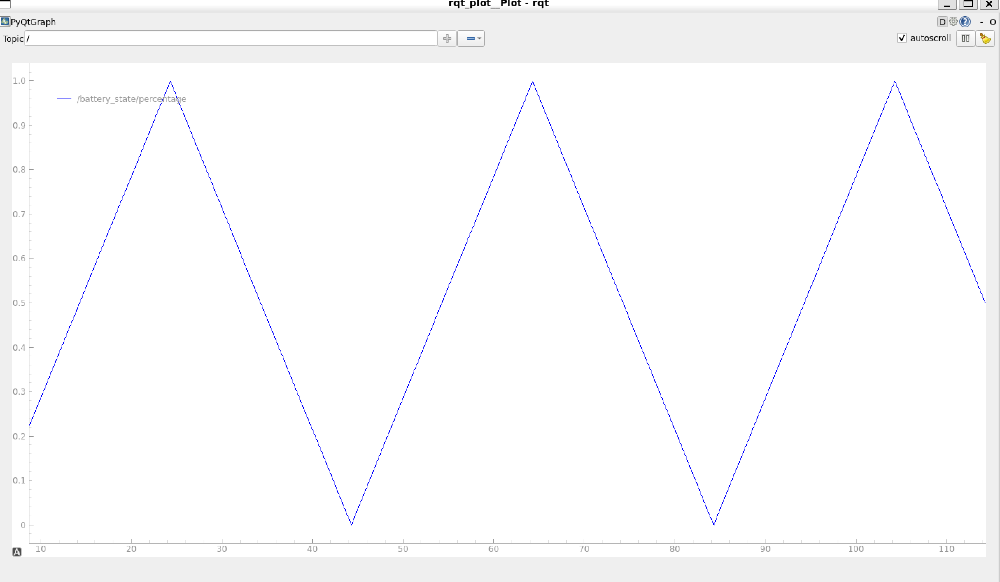
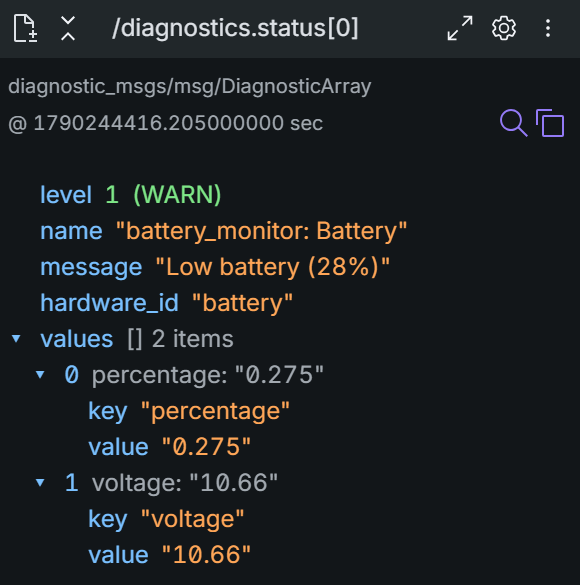

# `var_zfe_kisbead` package
ROS 2 Python package.  [](https://docs.ros.org/en/humble/)

A package két node-ból áll. A `/battery_sim` egy robot 3 cellás LiPo akkumulátorát szimulálja: a töltöttség folyamatosan csökken, 0%-nál a robot "töltőre áll", majd 100%-ig feltölt és újra merül. Az akkumulátor állapotát `sensor_msgs/BatteryState` típusú topicban hirdeti. A `/battery_monitor` feliratkozik erre a topicra, és a töltöttség alapján másodpercenként egy `diagnostic_msgs/DiagnosticArray` típusú állapotjelentést hirdet (`OK`, `WARN`, `ERROR`, vagy `STALE`, ha nem érkezik adat). Megvalósítás `ROS 2 Humble` alatt.

## Package-ek és build

(workspace  `~/ros2_ws/`)

### Clone
``` r
cd ~/ros2_ws/src
```
``` r
git clone https://github.com/MateGellertVarga/var_zfe_kisbead
```

### Build
``` r
cd ~/ros2_ws
```
``` r
colcon build --packages-select var_zfe_kisbead --symlink-install
```

<details>

``` bash
source ~/ros2_ws/install/setup.bash
```
</details>

``` r
ros2 launch var_zfe_kisbead battery.launch.py
```

A node-ok külön is indíthatók:

``` r
ros2 run var_zfe_kisbead battery_sim
```

``` r
ros2 run var_zfe_kisbead battery_monitor
```

A launch fájl argumentumaival a merülés sebessége és a küszöbök is megadhatók, pl. gyorsabb merüléssel:

``` r
ros2 launch var_zfe_kisbead battery.launch.py discharge_rate:=0.05 warn_level:=0.4
```

## Graph



## Paraméterek

`/battery_sim`:

| Paraméter | Alapérték | Leírás |
|---|---|---|
| `publish_rate` | `2.0` | Hirdetési frekvencia [Hz] |
| `discharge_rate` | `0.02` | Merülési sebesség [töltöttség / s], alapértéken kb. 50 s alatt merül le |
| `charge_rate` | `0.05` | Töltési sebesség [töltöttség / s] |
| `capacity` | `5.0` | Kapacitás [Ah] |

`/battery_monitor`:

| Paraméter | Alapérték | Leírás |
|---|---|---|
| `warn_level` | `0.3` | Ez alatti töltöttségnél `WARN` |
| `error_level` | `0.1` | Ez alatti töltöttségnél `ERROR` |
| `timeout` | `3.0` | Ennyi másodperc adat nélkül `STALE` |

Töltés közben az állapot mindig `OK`.

## Működés

A launch kimenete, a monitor csak állapotváltáskor ír a terminálba:



A töltöttség `rqt_plot`-ban (`ros2 run rqt_plot rqt_plot /battery_state/percentage`):



A `/diagnostics` topic egy üzenete Foxglove Studio-ban, `WARN` állapotban (`ros2 launch var_zfe_kisbead foxglove_bridge.launch.py`, majd `ws://localhost:8765`):

<p align="left"></p>

A topicok tartalma terminálban is ellenőrizhető:

``` r
ros2 topic echo /battery_state --field percentage
```

``` r
ros2 topic echo /diagnostics
```
